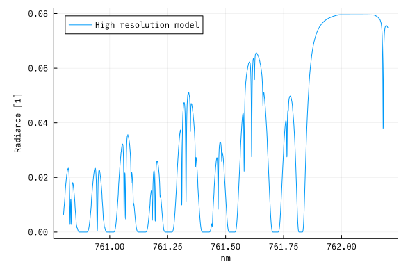
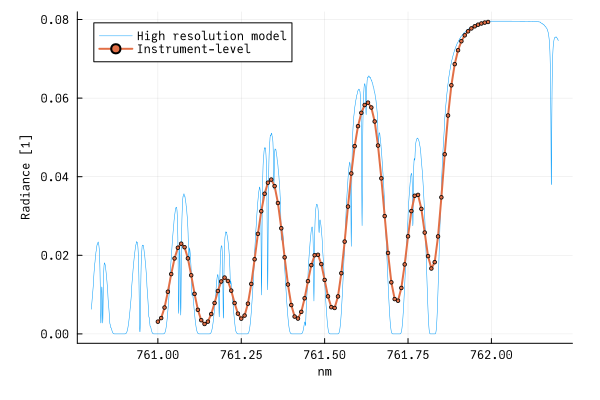

# RetrievalToolbox
[][docs-dev-url]
[](https://retrievaltoolbox.github.io/RetrievalToolbox-Tutorials/)
[](https://opensource.org/licenses/BSD-3-Clause)

RetrievalToolbox is a library for building trace gas retrieval algorithms and related applications written in pure [Julia](https://julialang.org). The library is currently in an early release stage, and feature-breaking updates might happen - although we attempt to keep those to a minimum. For the time being, we recommend to fork this repository into your own GitHub organization and integrate updates from here as to not break your own application.

RetrievalToolbox was developed at the Earth System Science Interdisciplinary Center (ESSIC) at the University of Maryland College Park, and at NASA Goddard Space Flight Center.


## Documentation and Learning

The main documentation is part of the repository under `docs/`, and the corresponding HTML render can be found [here][docs-dev-url].

Learning materials can be found [here](https://retrievaltoolbox.github.io/RetrievalToolbox-Tutorials/) - new users are **strongly encouraged** to read through these tutorials.

Looking at working examples is also highly instructive:

 * [EMIT retrieval demo for AGU2025 (New Orleans, USA, 2025)](https://github.com/RetrievalToolbox/EMIT-retrieval/)
 * [Demo for IWGGMS21 (Takamatsu, Japan, 2025)](https://github.com/US-GHG-Center/IWGGMS21-Demo)
 * [Implementation of NASA's ACOS algorithm](https://github.com/RetrievalToolbox/ACOS-Goddard/)

_Users are very welcome to submit their working set-ups to be listed here!_

## Installation

> [!TIP]
> For users who do not currently have Julia installed: it is **highly** recommended to install Julia via [JuliaUp](https://github.com/JuliaLang/juliaup), the Julia version multiplexer which allows to easily update Julia versions as well as to seamlessly switch between different versions.

RetrievalToolbox can be installed directly from Julia by typing (via http)

    using Pkg
    Pkg.add(url="https://github.com/US-GHG-Center/RetrievalToolbox.jl")

or (via ssh)

    using Pkg
    Pkg.add(url="git@github.com:US-GHG-Center/RetrievalToolbox.jl")

This will install the RetrievalToolbox including all needed dependencies.

If you forked this repository, you must amend the above commands to pull the package from your new repository location.

## First steps

RetrievalToolbox is a software library that does not include a true stand-alone implementation of any particular application. However, the following lines can be seen as a minimum working example that ultimately produce instrument-level radiance for a high-spectral resolution instrument that measures top-of-atmosphere spectra in a down-looking viewing geometry. Note that this example requires the Julia package `Unitful` work correctly. Further, to create the figures as shown below, the package `Plots` is needed:

    using Pkg
    Pkg.add("Unitful")
    Pkg.add("Plots") # optional

First, we load the required modules.

    using Unitful
    using Plots # optional
    using RetrievalToolbox; const RE = RetrievalToolbox

We pick a small spectral window, in this case a small section of the famed oxygen A-band, which has been an important absorption band for trace gas remote sensing, as it allows to further constrain aerosol scattering as well as the total air column.

    wavelength_start = 761.0u"nm"
    wavelength_end = 762.0u"nm"
    wavelength_ref = (wavelength_start + wavelength_end) / 2

    gas_name = "O2"

To produce a model atmosphere with meaningful meteorological profiles (specific humidity, temperature), we load an example data file that is part of the RetrievalToolbox repository.

    my_source_atmosphere = RE.create_example_atmosphere("US-midwest-summer", 10)

Modelling gas absorption in RerievalToolbox requires spectroscopy. These are fundamental to most atmospheric gas retrievals, as they allow us to translate atmospheric abundance to optical transmission for given wavelengths (or wavenumbers). Note, the following function downloads line lists from the online [HITRAN](https://hitran.org) library, and only works with an active internet connection.

    my_spectroscopy = RE.create_ABSCO_from_HITRAN(
        gas_name,
        wavelength_start - 0.5u"nm", # Put some buffer around our requested wavelengths
        wavelength_end + 0.5u"nm";
        wavelength_output=true, # Produce spectroscopy in wavelengths (rather than wavenumbers)
        h2o_broadening=false # Ignore broadening due to H2O
    )

We can now attach the spectroscopy object to something that represents a gaseous absorber.

    my_gas = RE.GasAbsorber(
        gas_name,
        my_spectroscopy,
        fill(20.95, 10), # Oxygen VMR is 20.95%
        Unitful.percent # Unit of VMR profile
    )

A spectral window is needed to determine the underlying spectral grid on which the monochromatic radiative transfer calculations will be performed. Below function helps with creating that object.

    my_spectral_window = RE.spectralwindow_from_ABSCO(
        "$(gas_name)_window",
        wavelength_start |> ustrip,
        wavelength_end |> ustrip,
        wavelength_ref |> ustrip, # Set the reference point
        0.2, # Buffer length in same units as everything else
        my_spectroscopy,
        unit(wavelength_start)
    )

Sitting on top of a `SpectralWindow` is a so-called dispersion, which provides the relationship between a detector element (think of a pixel on a CCD detector) and the physical spectral quantity that we carry along in our model.

    my_dispersion = RE.SimplePolynomialDispersion(
        [wavelength_start, 0.01u"nm"], # Linear dispersion: start and increment
        0:99, # Spectral element numbers (no particular meaning in this example)
        my_spectral_window
    )

For now, we are only interested in generating a spectrum, so we use a placeholder for the state vector object

    my_state_vector = RE.ForwardModelStateVector()

The following lines set up so-called buffer objects. They are placeholders that will contain various results of intermediate computations required at different parts of most workflows.

    N1 = 2 * length(my_spectroscopy.wavelength)
    N2 = 2 * length(my_dispersion.detector_samples)

    my_instrument_buffer = RE.InstrumentBuffer(
        zeros(Float64, N1),
        zeros(Float64, N1),
        zeros(Float64, N2),
    )

    my_rt_buffer = RE.ScalarRTBuffer(
        Dict(my_spectral_window => my_dispersion),
        RE.ScalarRadiance(Float64, N2), # To hold the radiance - we use ScalarRadiance because we don't need polarization
        nothing, # Usually holds Jacobians (which we do not need for this example)
        Dict(my_spectral_window => zeros(Int, 0)), # Hold the detector indices
        Unitful.NoUnits # Radiance units for the forward model
    )

    my_buffer = RE.EarthAtmosphereBuffer(
        my_state_vector,
        my_spectral_window, # The spectral window (or a list of multiple)
        [(:Lambert, 1)], # Surface types, and degree of polynomial
        [my_gas], # List of elements that are part of the atmosphere
        Dict(my_spectral_window => RE.UnitSolarModel()), # Create solar models, and map them to the spectral windows
        [:BeerLambert], # Which RT model to use for each spectral window?
        RE.ScalarRadiance, # Use ScalarRadiance for high-res radiance calculations
        my_rt_buffer, # The RT buffer object
        my_instrument_buffer, # The instrument buffer object
        10, # The number of retrieval or RT pressure levels
        my_source_atmosphere.N_met_level, # The number of meteorological pressure levels, as given by the atmospheric inputs
        Float64 # The chosen Float data type (e.g. Float16, Float32, Float64)
    )

The following steps are usually part of a separate, user-defined and therefore custom forward model function. For this minimal example, however, we skip defining this function and perform the few needed function calls manually.

First, we compute the so-called *incides*, which is the term used for arrays of integers that map the results from the radiative transfer calculations to the corresponding positions in the buffer arrays. While this assignment might be trivial for an application with only one spectral window, it is a vital bookkeeping mechanism to keep track of the results for multiple spectral windows.

    RE.calculate_indices!(my_buffer)

Copy over the meteorological data we have stored in the source atmosphere:

    my_buffer.scene.atmosphere.met_pressure_levels[:] = my_source_atmosphere.met_pressure_levels[:]
    my_buffer.scene.atmosphere.specific_humidity_levels[:] = my_source_atmosphere.specific_humidity_levels[:]
    my_buffer.scene.atmosphere.temperature_levels[:] = my_source_atmosphere.temperature_levels[:]

Set our custom pressure grid at which the gas VMRs are defined (all in Pa):

    my_buffer.scene.atmosphere.pressure_levels[:] = [
        1.0, # 1
        1_00.0, # 2
        10_00.0, # 3
        30_00.0, # 4
        100_00.0, # 5
        200_00.0, # 6
        400_00.0, # 7
        700_00.0, # 8
        800_00.0, # 9
       1000_00.0, # 10 - this is the surface pressure!
    ]

Let RetrievalToolbox calculate the mid-layer altitudes and gravity values. This is based on the location of the scene (which can be accessed via `my_buffer.scene.location`), which defaults to (0°, 0°) and 0 m surface elevation. This also re-calculates ALL relevant mid-layer values from level quantities.

    RE.calculate_altitude_and_gravity!(my_buffer.scene)

Now we should set the surface reflectance to some value. Here we simply pick the zeroth-order coefficient to be some reasonable value, which makes the surface reflectance spectrally flat at that value.

    my_buffer.scene.surfaces[my_spectral_window].coefficients[1] = 0.25

Let RetrievalToolbox calculate the optical properties due to gas absorption. This would also calculate e.g. Rayleigh scattering, aerosol absorption and scattering optical depth profiles etc., if we had added them to the list of atmospheric components.

    RE.calculate_earth_optical_properties!(
        my_buffer.rt[my_spectral_window].optical_properties,
        my_buffer.scene,
        my_state_vector
    )

Solar irradiance must also be calculated, otherwise, the TOA radiance will end up being simply zero everywhere. Since we use a simple solar model (`UnitSolarModel`), the solar irradiance will show up as a series of 1s, which we could have manually done. This however, is good practice to make sure we do not forget the solar irradiance calculation.

    RE.calculate_solar_irradiance!(
        my_buffer.rt[my_spectral_window],
        my_spectral_window,
        my_buffer.rt[my_spectral_window].solar_model
    )

Finally, we can trigger the calculation which produces the TOA radiance according to the Beer-Lambert-Bouguer law, which assumes an absorption-only atmosphere (no scattering processes, no thermal emission)

    RE.calculate_radiances_and_jacobians!(my_buffer.rt[my_spectral_window])

Plot the results of the radiative transfer on the high-resolution model spectral grid:

    plot(
        my_spectral_window.wavelength_grid * my_spectral_window.wavelength_unit,
        my_buffer.rt[my_spectral_window].hires_radiance,
        label="High resolution model radiance",
        ylabel="Radiance [1]"
    )



In order to model what this spectrum would look like if measured by an instrument with a finite spectral response, we can apply an instrument spectral response function. For this example, we choose a simple Gauss-shaped response with a specific width (given by its full width at half-maximum, or FWHM).

    my_isrf = RE.GaussISRF(0.05, u"nm")

    RE.apply_isrf_to_spectrum!(
        my_instrument_buffer,
        my_isrf,
        my_dispersion,
        my_buffer.rt[my_spectral_window].hires_radiance.I
    )

And finally, we can plot the at-instrument radiance which is temporarily stored in the instrument buffer object `my_instrument_buffer`:

    plot(
        my_spectral_window.wavelength_grid * my_spectral_window.wavelength_unit,
        my_buffer.rt[my_spectral_window].hires_radiance,
        label="High resolution model",
        linewidth=0.5, ylabel="Radiance [1]"
    )

    plot!(
        my_dispersion.wavelength,
        my_instrument_buffer.low_res_output[my_rt_buffer.indices[my_spectral_window]],
        label="Instrument-level",
        linewidth=2.0,
        marker=:circle, markersize=2
    )




## Building XRTM and making RetrievalToolbox aware of its location

RetrievalToolbox makes use of the XRTM library to perform the various radiative transfer calculations which require scattering from, e.g. molecular Rayleigh scattering or aerosols. While it is possible to use RetrievalToolbox with a built-in Beer-Lambert-Bouguer method, many retrieval applications will need to account for scattering and thus require the XRTM library. XRTM is published at (https://github.com/gmcgarragh/xrtm/), and we also maintain a fork at (https://github.com/RetrievalToolbox/xrtm). Depending on your needs and the way how you create your own algorithm, you might prefer one vs. the other option.

To build XRTM, you need somewhat recent versions of GCC, gfortran and make. First, clone the repository into some location on your computing environment:

`git clone https://github.com/gmcgarragh/xrtm`

or

`git clone https://github.com/RetrievalToolbox/xrtm`

Note that as of May 2025, the first repository does not compile on MacOS without modifications to the makefile. The second repository, however, should compile successfully. In either case, you must take a copy of the example makefile and save it as `make.inc`. So switch to the XRTM directory (`cd xrtm`) and

`cp make.inc.example make.inc`

Now you have to edit `make.inc` to work seamlessly with your environment. Usually, you will need at least the following edits:

1. `CC= ` set your (GNU) C compiler executable. Something like `CC=gcc` might work on most computers.
2. `CXX= ` set your (GNU) C++ compiler executable. `CC=g++` should work.
3. `F77= ` and `F90= ` set your (GNU) Fortran77 and Fortran90 compilers. `F77=gfortran` and `F90=gfortran` should work.
4. Set your LAPACK library location. On MacOS, this likely needs to be set to `-framework Accelerate`, and on Linux machines, you will likely have many options, including various OpenBLAS options, or Intel's MKL.

**On recent versions of MacOS, `gcc` invokes the Clang compiler rather than the GNU compiler suite.** Apple Clang does not work with the `-fopenmp` flag, and thus building XRTM will not work. We recommend downloading GCC (and gfortran) via [`homebrew`](https://brew.sh), by typing `brew install gcc`. To then call this freshly installed GCC compiler, one needs to add the version number, i.e. `gcc-15`. Use `gcc-15`, `g++-15` etc. to edit the Makefile.

Once those are set, simply type `make` to build the XRTM library. Note that you will have to make more substantial changes if you want to compile with e.g. Intel's compiler suite. If you do not have a LaTeX distribution with `pdflatex` on the computer, the build process will exit with an error message, but that only concerns the compilation of the documentation which is part of the makefile; by that point the library will have been built successfully and is ready to use.

RetrievalToolbox looks in a particular place to find the XRTM Julia interface file (which is part of XRTM), and it is determined by the environment variable `XRTM_PATH`, which should point to the main source tree that you just cloned. So in an interactive environment, you should, for example, start a Julia session with

`XRTM_PATH=/path/to/xrtm julia`

Or if you use RetrievalToolbox in a jupyter environment, start it up appropriately with e.g.

`XRTM_PATH=/path/to/xrtm jupyter-lab`

Alternatively, if that variable is exported beforehand, the variable will be also correctly set in Julia. Environment variables in Julia are accessible in the `ENV` dictionary, which is also writable from within a Julia session. So if `XRTM_PATH` is not set before the Julia session started, you can simply change it before loading the RetrievalToolbox module:

``` julia
ENV["XRTM_PATH"] = "/path/to/xrtm"
using RetrievalToolbox
```

**Important!** The second repository (https://github.com/RetrievalToolbox/xrtm) contains a small, but very impactful code modification. In `xrtm/src/xrtm.h` the pre-processor directive was changed to say
``` c
#define DO_NOT_ADD_SFI_SS 1
```
(instead of `#define DO_NOT_ADD_SFI_SS 0`). This has the effect that for certain RT solvers, such as the `eig_bvp` or `two_stream` ones, the contributions from single-scattering **are not automatically computed and added** to the total radiance fields and their derivatives. This is the wanted behavior for some applications, such as retrievals from NASA's OCO instruments, where you may want to compute the single-scatter contributions with a vector RT call, but the diffuse (MS) contributions with a scalar RT call. **Be aware that this is a compile-time choice** at the moment, so switching between `#define DO_NOT_ADD_SFI_SS 0` and `#define DO_NOT_ADD_SFI_SS 1` requires re-compiling. Alternatively, you can keep two copies of the code with the two different variants for this variable, and point RetrievalToolbox to a different path when you run it via changing `XRTM_PATH`.

## Citing RetrievalToolbox

We will be working in the future to submit an entry to the Journal of Open Source Software (JOSS), which will allow citing RetrievalToolbox with a proper DOI.

## Contributing

Contributions are always welcome, whether bug reports, bug fixes (through pull requests), suggestions, feature requests or otherwise. Please use the GitHub [issue tracker](https://github.com/US-GHG-Center/RetrievalToolbox.jl/issues).

## Alternatives

RetrievalToolbox was heavily influenced by the hard work of numerous scientists in different labs and institutions in various countries. Some of those algorithms have been under development for over a decade and have a proven track record of reliability. Prominent and publicly available alternatives are

- NASA's RtRetrievalFramework (https://github.com/NASA/RtRetrievalFramework) and ReFRACtor (https://github.com/ReFRACtor)
- SRON's RemoteC (https://bitbucket.org/sron_earth/remotec_general/src/main/)


[docs-dev-url]: https://US-GHG-Center.github.io/RetrievalToolbox.jl/dev/
