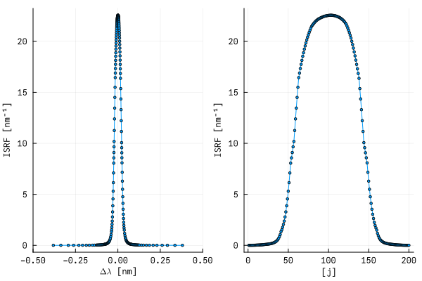

# [Core Algorithm Concepts](@id core_concepts)

!!! note
    Within the RetrievalToolbox algorithm tools, an attempt is made to keep notation consistent as well as stick to more modern terminology. This approach occasionally overrides more antiquated terms, so various sections in the documentation will emphasize when a possible clash is expected.

## [Pixels, Spectral Samples and Dispersion](@id samples)

The distinction between pixels, samples and what dispersion describes occasionally causes confusion due to a lack of consistent terminology in publications or other various documents.

A pixel is considered to be a discrete unit on an instrument detector of any type (where appropriate). Some instruments aggregate pixels during the read-out process such that the data received does not truly reflect the physical detector elements. Other instruments do read out the detector on a native pixel level, however some form of processing is performed afterwards and the resulting data, as ingested by retrieval algorithms, can no longer considered to be per-pixel.

Retrieval algorithms, in general, act on calibrated, geo-located radiance data, often denoted as Level-1b (L1B, L1b). For hyperspectral data, there usually is at least one spectral dimension of that data such that when the data is extracted along that dimension, one obtains what is considered a **spectrum**. One spectrum thus has a discrete number of elements along its spectral axis and the spectral axis consists of spectral samples. Those spectral samples do not have to be identical with the underlying detector pixels. For most instruments, they are not. Even for instruments in which the detector pixels map 1:1 into spectral samples, it is a good choice to stay consistent in the terminology and refer to an element of a spectrum as spectral sample.

For a single spectrum ``I`` that is extracted from calibrated, geo-located radiance data, the spectral sample information can be written explicitly as ``I_{[s]}``, with $s$ being some index of its spectral dimension. ``I_{[s]}`` is naturally a discrete quantity with $s$ being a discrete index itself. Compare this to a theoretical description of radiance, which in general is a continuous function of wavelength or wavenumber ``\tilde{I}(\lambda)`` or ``\tilde{I}(\nu)``. In order to allow for a comparison between measured quantity ``I_{[s]}`` and a model radiance, one must know which wavelength or wavenumber corresponds to a spectral sample at index ``s``.

The relationship between spectral sample (index) and wavelength or wavenumber is usually called **dispersion**. An alternative term for dispersion is **wavelength (wavenumber) solution**. It is some general function $d$ which maps a spectral sample index to either wavelength or wavenumber, whichever is appropriate for the specific instrument: ``d(s) = \lambda_{[s]}`` or ``d(s) = \nu_{[s]}``. When ``d`` is known, it is straightforward to evaluate some continuous function ``\tilde{I}`` at the correct wavelength or wavenumber in order to compare it to a measured value: ``I_{[s]} \sim \tilde{I}{\left( d(s) \right)}``.

For many instruments, the function ``d`` is generally smooth and tends to be expressed as a polynomial which maps spectral sample to wavelength or wavenumber in the following way:

```math
    \lambda_{[s]} = \sum_{i=0}^{N} c_i \cdot s^i, \\
```

or

```math
    \nu_{[s]} = \sum_{i=0}^{N} c_i \cdot s^i.
```

The polynomial coefficients ``c`` are usually either available in the published measurement data, in accompanying documents, or in rare cases, have to be derived.

Dispersions in RetrievalToolbox are implemented under the abstract type umbrella of `AbstractDispersion`, and the type documentation can be found here: [dispersion types](@ref dispersion_types).

## Instrument Spectral Response Function (formerly ILS)

RetrievalToolbox is *mostly* instrument. There is no particular function provided that generates instrument-level radiances for a specific instrument, given the high-resolution model output. In practice, this is also not necessary. In almost all situations, it is sufficient to provide a 1-dimensional **instrument spectral response function**, or **ISRF**, which provides the response of a particular instrument spectral sample (see [section above](@ref samples)) to light that enters the instrument.

Then the instrument-level radiance is obtained by producing the sum of the model radiance in some spectral interval, weighted by the ISRF. In general terms, the radiance measured by the instrument at some wavelength ``\lambda`` (or wavenumber ``\nu``) is considered as

```math
    I(\lambda) = \int_{-\infty}^{+\infty} I^\mathrm{model}(\lambda') \cdot \mathrm{ISRF}(\lambda, \lambda') \:\mathrm{d}λ',
```

where ``I^\mathrm{model}(\lambda')`` is the (high-resolution) model radiance at some wavelength ``\lambda'``. The ISRF kernels are usually two-dimensional, as they vary with where on the detector the radiance was measured.

When working with real measurements, it is highly recommended to use the ISRF that is provided by the operators of the instrument, as ISRFs are generally measured under laboratory conditions and tend to be a much more accurate representation than any theoretical model. Let the ISRF be given for any spectral sample ``s`` as a set of discrete relative wavelengths (or wavenumbers), so we go from a continuous function ``\mathrm{ISRF}(\lambda,\lambda')`` to a discrete representation ``\mathrm{ISRF}[s][j]`` for spectral sample ``s``. Index ``j`` here represents an element of the relative wavelength axis akin to ``\lambda'`` in the first equation.



Above figure shows an example for an ISRF for the OCO-2 instrument at a particular spectrometer (out of 3), footprint (across-track element, out of 8) and one particular spectral sample (out of 1016). the left panel shows the ISRF via the actual values of ``\Delta\lambda'`` in nanometers, whereas the right panel shows the same data but arranges the data by index of the ``\Delta\lambda'`` dimension (1-200).

When implementing the above equation, RetrievalToolbox replaces the integral by a discrete sum via the trapezoidal rule and performs the computation like so.

```math
    I_{[s]} =
        \dfrac{
            1
        }
        {
            2 \cdot \| \mathrm{ISRF}_{[s]} \|
        }
        \cdot
        \sum_{j}
        \lparen
            \mathrm{ISRF}_{[s][\Delta\lambda_{j-1}]} \cdot I^{\mathrm{model}}({\lambda[s] + \Delta\lambda_{j-1}}) +
            \mathrm{ISRF}_{[s][\Delta\lambda_{j}]} \cdot I^{\mathrm{model}}({\lambda[s] + \Delta\lambda_{j}})
        \rparen
        \cdot
        \lparen
            \Delta\lambda_{j} - \Delta\lambda_{j-1}
        \rparen

```

where the norm of the ISRF at spectral sample $s$ is calculated itself as

```math
\| \mathrm{ISRF}_{[s]} \| = \sum_{j}
    \dfrac{1}{2}\cdot
    \lparen
        \mathrm{ISRF}_{[s][\Delta\lambda_{j-1}]} + \mathrm{ISRF}_{[s][\Delta\lambda_{j}]}
    \rparen
    \cdot
    \lparen
        \Delta\lambda_{j} - \Delta\lambda_{j-1}
    \rparen
```

In the above expression, the summation index ``j`` follows the spacing the of the high-resolution model radiance, which is usually much higher than the native spectral spacing that the ISRF data carries. Thus, the ISRF as shown in the equation above represents a spectrally over-sampled version of the ISRF that is provided by the instrument operators.
Note that the division by the sum of the ISRF is needed only to ensure normalization. If the ISRF is already normalized in such a way, then the division can be omitted.

RetrievalToolbox handles the required over-sampling internally, and users only have to supply an ISRF object that best describes the provided ISRF.

In older literature, what we call ISRF here is sometimes referred to as **ILS** or **instrument line shape (function)**, for example in the [OCO-2/3 algorithm theoretical basis document](https://disc.gsfc.nasa.gov/information/documents?title=OCO-2%20Documents). The term ISRF is preferred as it prevents confusion with the **line spread function**, which can also be abbreviated as ILS.